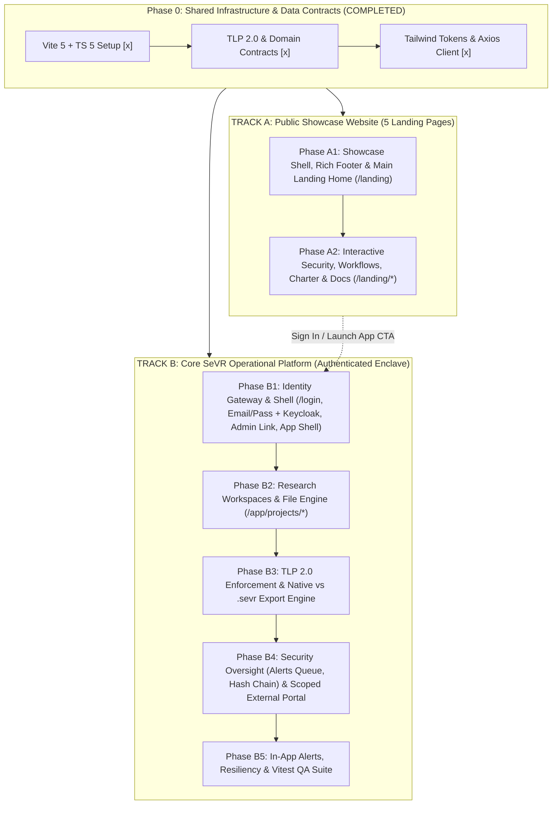
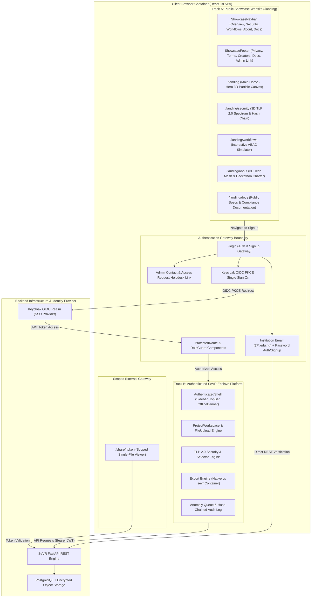
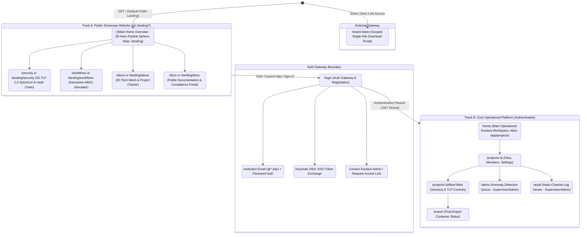
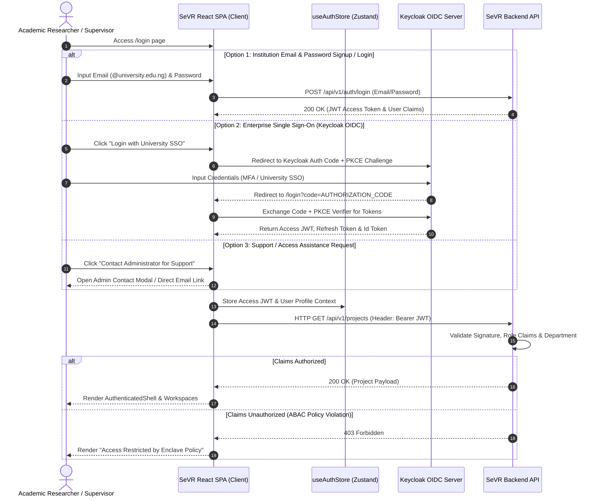
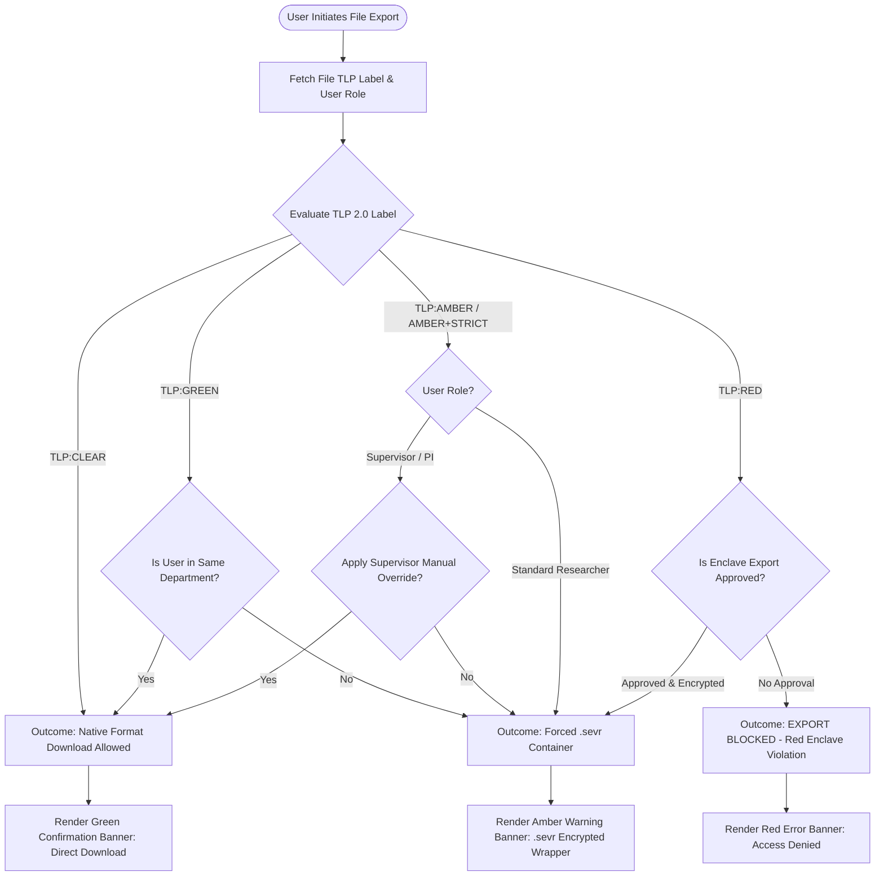

# SeVR 1.0 Frontend Implementation Specification: Phased Roadmap & Architecture

**Document Type:** Senior System Analyst & Architectural Specification  
**Target Platform:** React 18 + TypeScript 5 + Vite 5 + Tailwind CSS 3 + Three.js + Framer Motion *** [QA VETTING: GSAP Excluded to Enforce YAGNI & Prevent Dual Engine Bloat] ***  
**Project:** Scoped Enclave for Varsity Research (SeVR 1.0)  
**Track:** ICSC 2026 Universities Hackathon (Track F1)  
**Author:** Senior System Analyst & Architect (Jamil Muhammad Abdullahi, Bayero University Kano)  
**Date:** September 2026  
**Security Standard:** FIRST Traffic Light Protocol (TLP 2.0), RFC 7636 (OAuth 2.0 PKCE), NIST SP 800-171/53  

---

## 1. Executive Summary & Pragmatic Engineering Philosophy

This specification breaks down the frontend implementation of **SeVR 1.0** into a **dual-track, action-driven execution roadmap**. Adhering to pragmatic engineering principles (*"If It Works, Don't Make It Too Fancy"* / YAGNI), the architecture strictly segregates the **Public Educational Showcase Website (`/` & sub-pages)** from the **Core Authenticated SeVR Platform (`/login` & `/home/*`)**.

### Engineering Principles
1. **Clean Separation of Concerns**: Public promotional/educational pages (Track A under `/`) are decoupled from operational enclave application logic (Track B starting at `/login`).
2. **Minimalist & Pragmatic UI**: Zero speculative abstractions or ornamental bloat. Focus on fast rendering, clean typography, unambiguous security indicators, and micro-interactions that serve a functional purpose.
3. **FIRST TLP 2.0 Compliance**: Strict implementation of FIRST TLP 2.0 standards (`TLP:CLEAR`, `TLP:GREEN`, `TLP:AMBER`, `TLP:AMBER+STRICT`, `TLP:RED`).
4. **Dual Authentication & Admin Helpdesk**: Support both direct Institution Email/Password signup/login (`@*.edu.ng`, `@*.edu`) and Keycloak OIDC SSO, featuring explicit on-page admin contact instructions and support links.
5. **Zero-Trust Client Architecture**: Client-side enforcement of Attribute-Based Access Control (ABAC) and Role-Based Access Control (RBAC), backed by OIDC PKCE session management and cryptographic hash-chain verification.

---

## 2. System Architecture & Diagram Suite

### 2.1 High-Level Dual-Track Phased Roadmap

---

### 2.2 System Architecture & Component Isolation Boundary

---

### 2.3 Route Architecture & Security Access Map

---

### 2.4 Dual Authentication & Session Lifecycle Sequence

---

### 2.5 TLP 2.0 Security & Export Container Decision Engine Flowchart

---

## 3. Phase 0: Shared Infrastructure & Data Contracts

### Objective
Establish core dependencies, Vite configuration, Tailwind design tokens matching TLP 2.0 sensitivity levels, and TypeScript domain models.

### Detailed Deliverables
- [x] **Dependencies (`package.json`)**:
  - Core: `react`, `react-dom`, `react-router-dom`, `@tanstack/react-query`, `zustand`, `axios`.
  - 3D & Animation: `three`, `@types/three`, `@react-three/fiber`, `@react-three/drei`, `framer-motion`, `canvas-confetti` *** [QA VETTING: Approved stack is Three.js + Framer Motion. GSAP excluded to prevent dual-engine bundle bloat] ***.
  - UI Icons & Utilities: `lucide-react`, `clsx`, `tailwind-merge`.
- [x] **Vite Configuration (`vite.config.ts`)**: Alias path resolution `@/` mapping to `src/`.
- [x] **Tailwind Configuration (`tailwind.config.js`)**:
  - Color system mapping FIRST TLP 2.0 standard:
    - **`TLP:CLEAR`**: `bg-slate-100`, `text-slate-800`, `border-slate-300` (Public / Unrestricted).
    - **`TLP:GREEN`**: `bg-emerald-500/10`, `text-emerald-700`, `border-emerald-500` (Community / Sector).
    - **`TLP:AMBER`**: `bg-amber-500/10`, `text-amber-700`, `border-amber-500` (Need-to-Know Organization).
    - **`TLP:AMBER+STRICT`**: `bg-orange-500/10`, `text-orange-800`, `border-orange-600` (Strict Organization Only).
    - **`TLP:RED`**: `bg-rose-500/10`, `text-rose-700`, `border-rose-500` (Restricted Enclave Eyes-Only).
- [x] **Data Contracts (`src/types/index.ts`)**:
  - `TLP20Label`: `"CLEAR" | "GREEN" | "AMBER" | "AMBER_STRICT" | "RED"`
  - `UserRole`: `"researcher" | "supervisor" | "external_collaborator" | "institution_admin"`
  - `User`: `id`, `username`, `email`, `role`, `department`, `token`
  - `Project`: `id`, `name`, `description`, `ownerId`, `defaultTlp`, `memberCount`, `createdAt`
  - `SevrFile`: `id`, `projectId`, `name`, `originalFormat`, `tlpLabel`, `uploadedBy`, `uploadedAt`, `sizeBytes`, `checksumSha256`
  - `ExportDecision`: `outcome` (`"native" | "sevr_container" | "blocked"`), `reason`, `tlpLabelAtDecision`, `overrideApplied`
  - `DetectionAlert`: `id`, `detectorName`, `targetUser`, `riskScore`, `evidenceSummary`, `status`
  - `AuditEntry`: `id`, `timestamp`, `actor`, `action`, `resource`, `detail`, `previousHash`, `currentHash`

---

## 4. TRACK A: Public Showcase Website & Educational Portal (`/` & Sub-Pages)

*(Focuses on university hackathon demonstration, project charter, 3D WebGL visualizations, interactive feature simulators, documentation, and comprehensive legal/credits footer. Fully accessible without authentication.)*

### Phase A1: Public Website Layout, Rich Footer & Main Landing Home (`/`)

#### Objective
Build the persistent showcase navigation header, rich multi-column footer, and Page 1 main hero overview (`/`) featuring a 3D WebGL enclave particle shield and live project metrics.

#### Deliverables
- [ ] **`ShowcaseNavbar.tsx`**: Glassmorphic header with navigation links:
  - `Overview` (`/`)
  - `Security Architecture` (`/security`)
  - `Workflows` (`/workflows`)
  - `Project Charter` (`/about`)
  - `Documentation` (`/docs`)
  - Glowing 3D logo hover effect and prominent `"Sign In / Launch Enclave"` CTA button.
- [ ] **`ShowcaseFooter.tsx`**: Comprehensive, multi-column footer containing:
  - **Column 1: Platform & Security**: Enclave Overview, TLP 2.0 Security Protocol specs, SHA-256 Hash-chain integrity checks, System Status link.
  - **Column 2: Legal & Governance**: Privacy Policy (`/privacy`), Terms of Service & Data Governance (`/terms`), NIST SP 800-171 Compliance Statement.
  - **Column 3: Documentation & Resources**: Documentation Site Link (`/docs`), Public Developer API Specs, User Guide, Contact Admin Helpdesk link.
  - **Column 4: Creators & Acknowledgments**: Author credits (Jamil Muhammad Abdullahi, Bayero University Kano), ICSC 2026 Universities Hackathon (Track F1) details.
- [ ] **`ShowcaseOverviewPage.tsx` (`/`)**:
  - **3D Canvas (`EnclaveShieldCanvas.tsx`)**: Interactive 3D particle sphere built with `@react-three/fiber` that distorts and glows dynamically based on user cursor tracking.
  - **Hero Typography & Motion**: Framer Motion staggered entrance animations showcasing SeVR 1.0 value proposition.
  - **Live Metric Counter Cards**: Micro-animations highlighting zero data leakage guarantees, ABAC revocation, and hash-chain audit tracking.

---

### Phase A2: Interactive Security, Workflows, Charter & Documentation Pages (`/security`, `/workflows`, `/about`, `/docs`)

#### Objective
Construct Pages 2, 3, 4, and 5 of the public website explaining SeVR's security architecture, workflow automation, project charter, and public compliance documentation.

#### Deliverables
- [ ] **Page 2: Security Architecture (`ShowcaseSecurityPage.tsx` - `/security`)**:
  - **3D TLP 2.0 Visualizer (`TlpSpectrumCanvas.tsx`)**: WebGL particle scene shifting dynamically across FIRST TLP 2.0 spectrum states (`CLEAR` -> `GREEN` -> `AMBER` -> `AMBER+STRICT` -> `RED`).
  - **Container Transformation Diagram (`SevrTransformationDiagram.tsx`)**: Interactive step-by-step visual showing native file conversion into `.sevr` encrypted containers.
  - **Hash Chain Block Visualizer (`HashChainVisualizer.tsx`)**: Animated connected block sequence demonstrating SHA-256 integrity checks.
- [ ] **Page 3: Platform Workflows (`ShowcaseWorkflowsPage.tsx` - `/workflows`)**:
  - **Interactive Workflow Simulator (`WorkflowSimulator.tsx`)**: Step-by-step timeline allowing visitors to simulate:
    1. Student document upload with automatic TLP tag.
    2. Supervisor approval toggle.
    3. Instant ABAC member revocation (clicking "Revoke" snaps permissions shut with a visual pulse).
    4. Mass-download anomaly alert trigger.
    5. External link expiration countdown.
- [ ] **Page 4: Project Charter & Tech Mesh (`ShowcaseAboutPage.tsx` - `/about`)**:
  - **3D Tech Mesh Canvas (`TechMeshCanvas.tsx`)**: Force-directed 3D node graph displaying tech stack connections (React, TypeScript, Keycloak, FastAPI, PostgreSQL, `.sevr` Container Engine).
  - **Hackathon Context & Team Card**: Bayero University Kano track details and team attributes.
  - **Project Charter Accordion (`CharterAccordion.tsx`)**: Problem statement, non-functional requirements, and architecture principles.
- [ ] **Page 5: Documentation & Compliance Portal (`ShowcaseDocsPage.tsx` - `/docs`)**:
  - Public documentation viewer covering enclave deployment architecture, TLP 2.0 policy guidelines, REST API reference, and NIST SP 800-171 compliance controls.

---

## 5. TRACK B: Core SeVR Operational Platform (Authenticated Enclave)

*(Starts from the Authentication Gateway `/login`. Implements the secure operational workspace for academic researchers, PIs, and institution administrators.)*

### Phase B1: Identity Gateway, Dual Authentication, Admin Helpdesk & Operational Shell

#### Objective
Provide flexible authentication (Institution Email/Password registration/login alongside Keycloak OIDC SSO), explicit administrator contact instructions with support links on the auth page, establish route protection guards, and render the persistent operational application shell.

#### Deliverables
- [ ] **Authentication Gateway (`/login` & `/signup`)**:
  - **Dual Authentication Modes**:
    - **Option 1: Institution Email & Password**: Registration and authentication for university accounts (`@*.edu.ng`, `@*.edu` validation regex). Includes password strength meter and verification OTP link trigger.
    - **Option 2: Single Sign-On (SSO / Keycloak OIDC)**: Single-click button initiating OAuth 2.0 PKCE (RFC 7636) token exchange for federated identity providers.
  - **Admin Contact & Assistance Section**:
    - Embedded assistance box on the auth form: *"Need Enclave Access, Supervisor Escalation, or Account Recovery?"*
    - Clear step-by-step instructions on contacting the institution administrator.
    - Direct support link (`/support` modal or `mailto:sevr-admin@buk.edu.ng` link).
- [ ] **Auth Route Protection (`src/components/auth/ProtectedRoute.tsx`)**:
  - Wraps operational routes, validating JWT claims, expiration, and user roles (`researcher`, `supervisor`, `admin`). Unauthenticated users are redirected to `/login`.
- [ ] **Authenticated Application Shell (`src/components/layout/Shell.tsx`)**:
  - **`Sidebar.tsx`**: Project navigation (`/home`), Upload (`/upload`), Export & Share (`/export`), Detection Queue (`/alerts`), Audit Trail (`/audit`), active enclave badge.
  - **`TopBar.tsx`**: Enclave breadcrumbs, global search, user identity chip (Name, Department, Role badge), notification drawer, logout trigger.
  - **`OfflineBanner.tsx`**: Network state detector displaying top banner when offline (*"Offline Mode: Read-Only Enclave Access"*).

---

### Phase B2: Research Workspace, File Engine & ABAC Control System

#### Objective
Deliver operational screens for browsing projects, managing research files, tracking activity feeds, and enforcing Attribute-Based Access Control (ABAC) on project memberships.

#### Deliverables
- [ ] **Project List View (`src/pages/ProjectListPage.tsx` - `/home`)**:
  - Grid/Table layout displaying research projects, TLP summary, and member count.
  - **`CreateProjectModal.tsx`**: Dialog for creating new research projects (restricted to PIs/Supervisors).
- [ ] **Project Workspace View (`src/pages/ProjectWorkspacePage.tsx` - `/projects/:id`)**:
  - **Files Tab (`UploadDropzone.tsx`, `FileList.tsx`)**: Drag-and-drop uploader with TLP classification selector, upload progress bars, and file search.
  - **Activity Tab (`ActivityFeed.tsx`)**: Chronological audit timeline showing file additions, shares, export requests, and permission updates.
  - **Members Tab (`MemberList.tsx`)**: Member management panel with instant ABAC revocation trigger (*"Revoke Member"* button instantly terminates access rights).
  - **Settings Tab (`ProjectSettings.tsx`)**: Enclave metadata editor and project-wide default TLP policy selector.

---

### Phase B3: TLP 2.0 Security Enforcement, Export Engine & External Sharing

#### Objective
Implement the security core: TLP 2.0 badge and selector UI, the Export Decision Engine UI (supporting native format vs `.sevr` container outcomes), and signed external sharing.

#### Deliverables
- [ ] **TLP 2.0 Security Components (`src/components/tlp/`)**:
  - **`TlpBadge.tsx`**: Color-coded badge supporting FIRST TLP 2.0 levels (`CLEAR`, `GREEN`, `AMBER`, `AMBER+STRICT`, `RED`) with informative hover tooltips.
  - **`TlpSelector.tsx`**: Selector input enforcing privilege checks (disables `RED` / `AMBER+STRICT` selection for standard researchers without PI approval).
- [ ] **Export & Portability Engine UI (`src/components/sharing/`)**:
  - **`ExportDialog.tsx`**: Modal requesting export destination and format parameters.
  - **`ExportOutcomeBanner.tsx`**: Dynamic outcome status banner:
    - **Native Format**: Green confirmation banner showing direct file download link.
    - **Forced `.sevr` Container**: Amber warning banner explaining policy rationale (*"TLP:AMBER requires container encryption for external export"*).
    - **Blocked**: Red error banner indicating enclave policy violation.
  - **`ExportOutcomePage.tsx` (`/export`)**: Status dashboard showing container checksum, encryption parameters, and download trigger.
- [ ] **External Sharing Dialog (`ShareDialog.tsx`)**:
  - Modal form accepting recipient email, mandatory expiration datetime picker, and optional password/PIN. Generates signed external access link (`/share/:token`).

---

### Phase B4: Security Compliance Oversight & Scoped External Portal

#### Objective
Provide security administration tools for Supervisors and Institution Admins (anomaly detection queue, hash-chained audit trail viewer) and construct the scoped portal for external collaborators.

#### Deliverables
- [ ] **Anomaly Detection Queue (`src/pages/AlertsQueuePage.tsx` - `/alerts`)**:
  - Displays risk-scored alerts (mass downloads, off-hour access, off-pattern IP access).
  - Quick actions: `Acknowledge`, `Dismiss`, `Escalate to Admin`.
- [ ] **Hash-Chained Audit Trail (`src/pages/AuditTrailPage.tsx` - `/audit`)**:
  - Paginated, filterable compliance table rendering tamper-evident log entries (Timestamp, Actor, Action, Resource, SHA-256 Current Hash, SHA-256 Previous Hash, Verification Status).
- [ ] **Scoped External Collaborator Portal (`src/pages/ExternalCollaboratorPage.tsx` - `/share/:token`)**:
  - Isolated single-file viewer displaying file metadata, dynamic expiration countdown timer, and single download button. Completely stripped of main application navigation and reshare capabilities.

---

### Phase B5: In-App Alerts, Resiliency, Test Automation & Delivery

#### Objective
Incorporate real-time notification drawers, network resiliency features, automated unit/integration test suites, and conduct final production build verification.

#### Deliverables
- [ ] **In-App Notification Center (`NotificationBell.tsx`)**:
  - TopBar bell icon displaying unread badge count and slide-over notification history drawer.
- [ ] **Performance & Resilience Tuning**:
  - Export decision latency strictly bounded (<2s UX evaluation time).
  - WebGL 3D Canvas performance budget maintained at 60fps with automatic canvas fallback for low-power GPUs.
  - Responsive design verified across 1280px, 1440px, and 1920px laptop viewports.
- [ ] **Automated Verification Suite (`frontend/src/__tests__/`)**:
  - **Unit Tests (Vitest)**: `TlpBadge.test.tsx`, `TlpSelector.test.tsx`, `ExportOutcomeBanner.test.tsx`.
  - **Integration Tests**: `AuthFlow.test.tsx`, `ProjectWorkspace.test.tsx`.
  - **Build Verification**: Clean compilation (`tsc -b && vite build`) with zero broken references.

---

## 6. Deliverables Summary Matrix

| Phase | Core Track | Key Deliverables & Code Artifacts | Primary Routes |
| :--- | :--- | :--- | :--- |
| **Phase 0** | Shared Base (Done) | `types/index.ts`, `tailwind.config.js`, `vite.config.ts`, Axios client | N/A |
| **Phase A1** | Track A (Public) | `ShowcaseNavbar.tsx`, `ShowcaseFooter.tsx`, `ShowcaseOverviewPage.tsx`, `EnclaveShieldCanvas.tsx` | `/` (Default Public Landing), `/landing` |
| **Phase A2** | Track A (Public) | `ShowcaseSecurityPage.tsx`, `ShowcaseWorkflowsPage.tsx`, `ShowcaseAboutPage.tsx`, `ShowcaseDocsPage.tsx` | `/security`, `/workflows`, `/about`, `/docs` |
| **Phase B1** | Track B (Platform) | `/login` handler (Email/Pass + Keycloak), Admin Link, `Sidebar.tsx`, `TopBar.tsx`, `Shell.tsx` | `/login`, `/home` (Default Main App) |
| **Phase B2** | Track B (Platform) | `ProjectListPage.tsx`, `ProjectWorkspacePage.tsx`, `UploadDropzone.tsx`, `MemberList.tsx` | `/home`, `/projects/:id` |
| **Phase B3** | Track B (Platform) | `TlpBadge.tsx`, `TlpSelector.tsx`, `ExportOutcomeBanner.tsx`, `ShareDialog.tsx`, `ExportOutcomePage.tsx` | `/projects/:id/files/:fileId`, `/export` |
| **Phase B4** | Track B (Platform) | `AlertsQueuePage.tsx`, `AuditTrailPage.tsx`, `ExternalCollaboratorPage.tsx` | `/alerts`, `/audit`, `/share/:token` |
| **Phase B5** | Track B (Platform) | `NotificationBell.tsx`, `OfflineBanner.tsx`, Vitest test suite | All Routes |

---

## 7. Operational Constraints & Non-Functional Requirements

1. **Screen Resolution Target**: Primary optimization for laptop viewports (1280px, 1440px, and 1920px displays).
2. **Export Latency**: Policy evaluation and outcome decision rendering must execute within **2.0 seconds**.
3. **Graphics Fallback**: 3D Canvas components (`EnclaveShieldCanvas`, `TlpSpectrumCanvas`, `TechMeshCanvas`) must include graceful 2D CSS fallbacks for WebGL-disabled environments.
4. **Out of Scope (v1.0)**:
   - Native mobile applications (iOS/Android).
   - Real-time collaborative document editing.
   - Fully automated unconfirmed TLP classification.
   - Dark mode for operational enclave workspace (default is light theme; dark glassmorphism reserved for showcase site).
   - Multi-language internationalization (i18n).

---

*End of SeVR 1.0 Frontend Implementation Specification*
